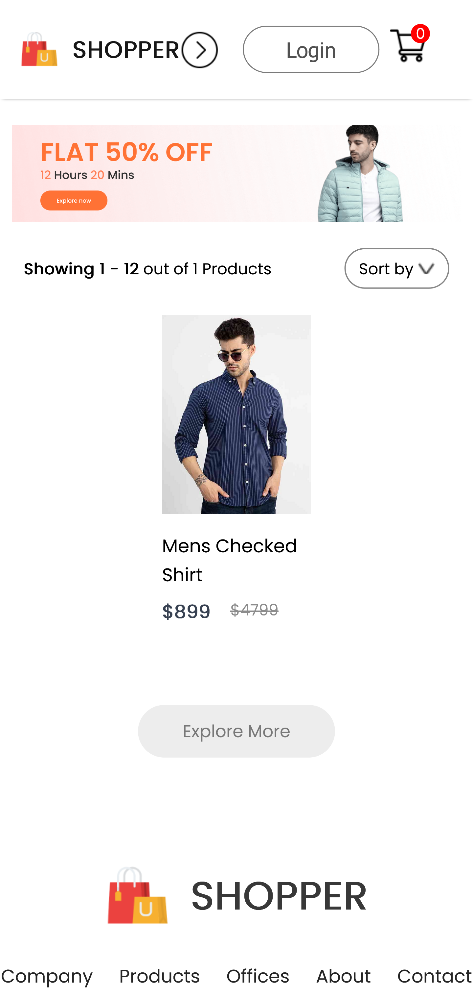

# MERN-E-Commerce-Frontend

> Frontend of the E commerce clone app made with React.

     

## 📋 Table of Contents

- [Features](#features)
- [Installation](#installation)
- [Usage](#usage)
- [Tech Stack](#tech-stack)
- [Screenshots](#screenshots)

## ℹ️ Project Information

- **👤 Author:** ReavanthKumar
- **📦 Version:** 1.0.0
- **📄 License:** MIT
- **🌐 Website:** [https://frontend.reavanth.app](https://frontend.reavanth.app)
- **📂 Repository:** [https://github.com/ReavanthKumar/MERN-E-Commerce-Frontend](https://github.com/ReavanthKumar/MERN-E-Commerce-Frontend)

## Features

- **User Authentication:** Secure Login and Signup functionality.
- **Product Browsing:** Browse products by categories (Men, Women, Kids).
- **Product Details:** View detailed product information and related products.
- **Shopping Cart:** Add items to cart, view cart summary, and proceed to checkout.
- **Responsive Design:** Optimized for various device sizes.

## Installation

1.  Clone the repository:
    ```bash
    git clone https://github.com/ReavanthKumar/MERN-E-Commerce-Frontend.git
    ```
2.  Navigate to the project directory:
    ```bash
    cd MERN-E-Commerce-Frontend/e-commerce-frontend
    ```
3.  Install dependencies:
    ```bash
    npm install
    ```

## Usage

Start the development server:

```bash
npm start
```

The application will be available at `http://localhost:3000`.

## Tech Stack

- **Frontend Framework:** [React](https://reactjs.org/)
- **Routing:** [React Router DOM](https://reactrouter.com/)
- **State Management:** React Context API
- **Styling:** CSS

## Screenshots

### Men's Section


